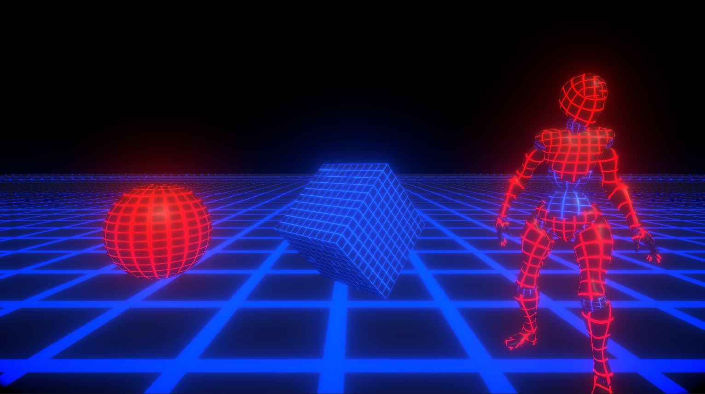

# URP (LWRP)-Shaders
A Collection of Shaders For "Universal Render Pipeline" (LWRP) Render Pipeline

Unity 2019.3.9f 
URP(LWRP) V7.3.1

- HexSphere Shaders :

- Water Shaders :

- Clouds Shaders :

- Fire Shader : 

  
   

- Fog Shader :

- Grid Shader :

- Snow Shader :

- Water Shader :

- UI Shaders : 
	 Outline and Rounded Corner Shader.

- Steplling distance fade Shader :

- Flow Map shader :

- Interioir Shader :

- Road Shader :
