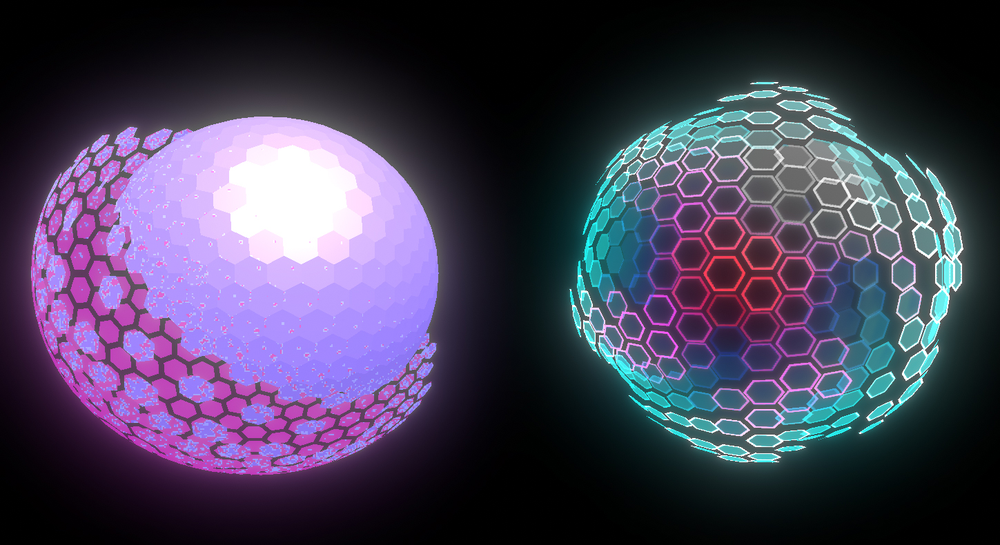
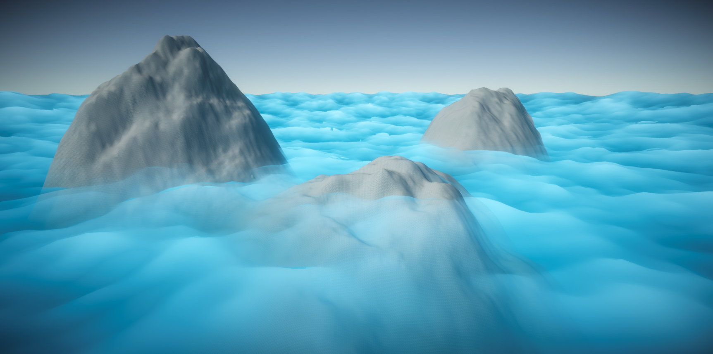
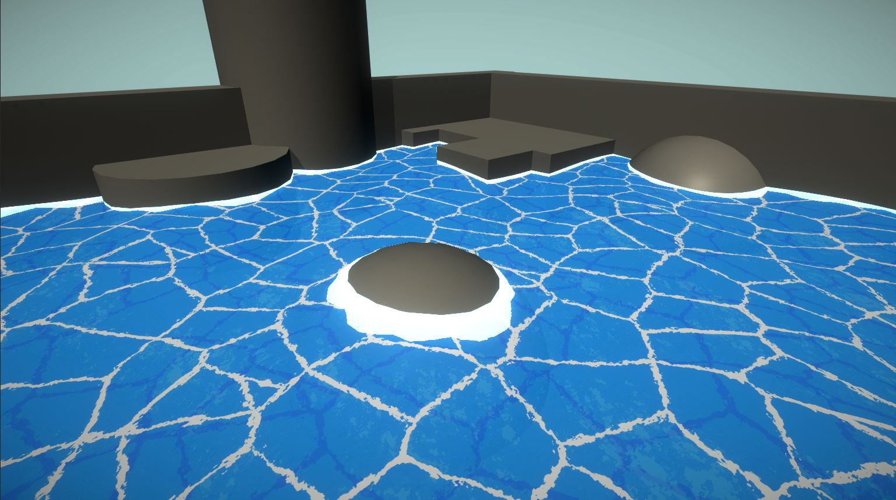
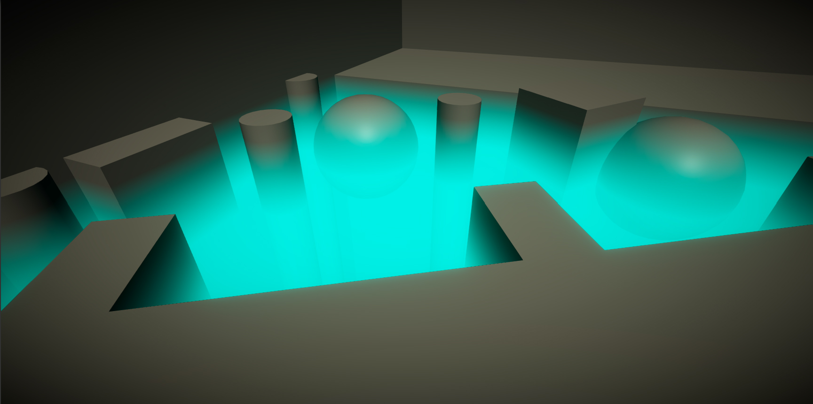
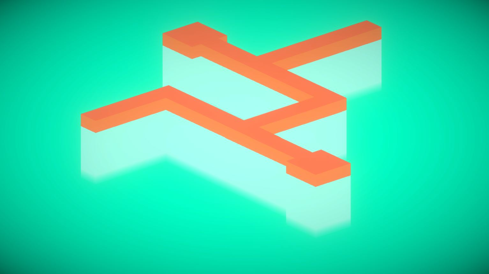
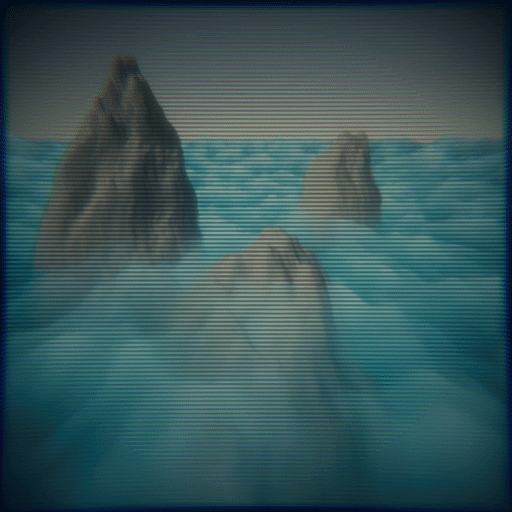
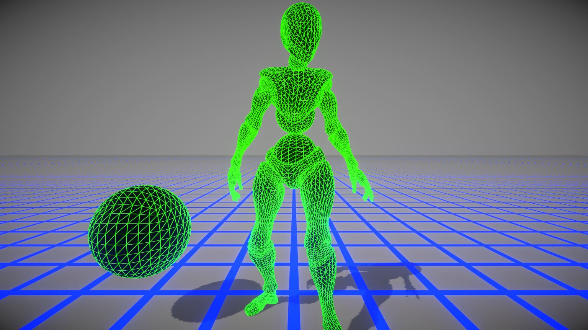
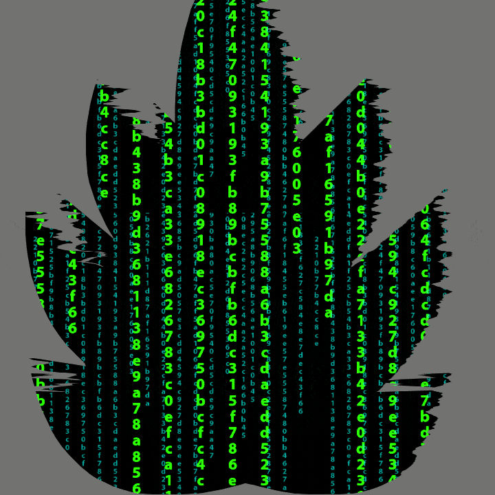

# URP (LWRP)-Shaders
A Collection of Shaders For "Universal Render Pipeline" (LWRP) Render Pipeline

Unity 2020.1.2f 
URP(LWRP) V8.2

- HexSphere Shaders :

- Clouds Shaders :

- Stylized Water Shader :

- Vertical Fog Shader :

- Fire Shader : 

  
   

- Steplling distance fade Shader & CRT-TV :

 
  
   

- WireFrame Shader :

- Matrix Glitch Effect :

 
  

- Snow Shader :

- UI Shaders : 
	 Outline and Rounded Corner Shader.

- Flow Map shader :

- Interioir Shader :

- Road Shader :
